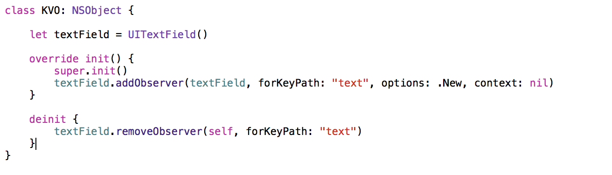
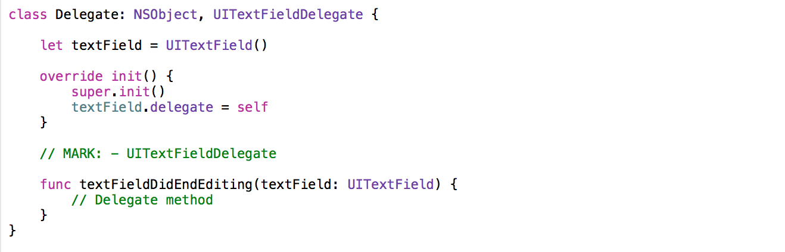
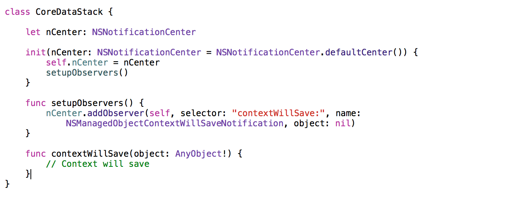
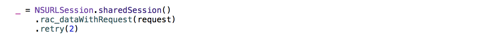

# Introduction to Reactive Programming

## What’s Reactive Programming (RP)?
You might have heard before about RP, even you might have seen some examples. According to **[Wikipedia](https://en.wikipedia.org/wiki/Reactive_programming)**

> In computing, Reactive Programming is a programming paradigm oriented around **data flows** and the propagation of change. This means that it should be possible to express static or dynamic data flows with ease in the programming languages used, and that the underlying execution model will automatically propagate changes through the data flow.
> For example, in an Imperative Programming setting, `a = b + c` would mean that `a` is being assigned the result of `b + c` in the instant the expression is evaluated. Later, the values of `b` and  `c` can be changed with no effect on the value of `a`.
> In Reactive Programming, the value of `a` would be automatically updated based on the new values.

We understand RP as a paradigm where the information/data/events flow in an “channel” and our program/logic reacts according to these events. These channels where the information flows through  are called **streams** and the information sent are **events**.
All the events that take place in our app are now **events sources**, and these sources are **observables**. When they send event, we are responsible to operate with them, combining, mapping, filtering, or just simply, consuming them. Some examples of streams could be:

1. A web request where the data source would be the API client, and the events sent, the responses from the server.
2. The tap event on a button. The button itself would be the data source and the taps on the button would be the actions.
3. GPS user positions received from CoreLocation.

You might have noticed that almost everything can be modeled as a stream of data, and you’re right. The components that you find in Cocoa framework and in most of libraries don’t offer public RP. Instead, you’ll find **extensions** that add the reactive behaviour to existing frameworks. We can then, create a native API to model user interactions with the app, the app with local data sources, and also, why not? with remote data sources.

I> RxSwift has recently created a [community](http://community.rxswift.org/) publishing different projects, and extensions that are using RxSwift. You find projects like [RxAlamofire](https://github.com/RxSwiftCommunity/RxAlamofire) that makes the popular [Alamofire](https://github.com/Alamofire/Alamofire) Reactive. Or [Action](https://github.com/RxSwiftCommunity/Action) that encapsulates an action to be performed, usually by a button press. Contains helpful extensions on a variety of UI classes.

The events received from these streams will be mostly consumed directly and won’t require any manipulation before using them, but one of the main advantages of RP is the ease of applying operators to these events. These operators are defined as a functions that can be applied to the stream. The term functional appears, and joins the RP pardigm, **Functional Reactive Programming**. We couldn’t imagine RP without the use of functional concepts.

> An operator applied to a  stream is a function that given an input stream it returns another stream manipulating the events received by the source stream.

When we *consume* these events we can do it in two ways:

- **Observing**: We can directly observe the stream, and specify in a *closure* the operations to be executed depending on the type of event.
- **Binding**: Connecting streams with existing object. Every time an event is received from the stream, it automatically updates the object *(or object property)*.

For example, if we have a stream that sends collections of tasks to be shown in a table, and we have a collection that keeps a reference to the last returned collection, we can bind the signal that returns these collections to the collection property. That way it always reflect the last state when the stream sends new collections. It’s also very common use binding for UI elements. For example, updating the state of enabled in a button using a function that validates some text streams.

I> Remember, in RP we’re going to have three main components **Streams (observables), Operators and Bindings**. Later, we’ll see each of them with more details and the available operations.

## Observation patterns
When I started with the reactive concepts one of my firsts concerns was understanding which similar patters I had been using so far, the problems they presented, and how FRP could help or make them easier. You probably use some of them daily:

### KVO
Extensively used in Cocoa. It allows observing the state of the properties of a given object, and react to the changes. The main problem with KVO is that it’s not easy to use, the API is overloaded and it doesn’t offer and API based on blocks (closures in Swift).

{width=100%}

### Delegates

This is one of the first patterns that you learn when you give your first steps in the iOS/OSX development since most of the Apple frameworks will stick to it. *UITableViewDelegate, UITableViewDataSource, UITextViewDelegate ...* are some examples. The main problem that this pattern presents is that there can only be one delegate registered. If we're working with a more complex scenario where only one entity is not enough, this pattern requires some modifications to support multiple delegates *(for example a proxy class)*.

{width=100%}

### Notifications

When it's complex to get closer to the events source in order to *subscribe* to it we use the pattern that consists on broadcasting notifications. Do you know NSNotificationCenter? CoreData uses it to notify when a context is going to execute a saving operation. The problem with that pattern is that the information sent is returned using a dictionary, *UserInfo*, and the observer has to know previously the structure of that dictionary to parse it. Thus, there's no safety with the structure and types sent.

Reactive libraries available nowadays offer extensions to move from these patterns to reactive approaches. From generating signals from notifications sent to the NSNotificationCenter, to detecting taps on a UIButton.

{width=100%}

## Advantages

RP has big advantages used in contexts where it's pretty straightforward modeling the flow of events as a stream. As I commented previously, everything can be modeled as an stream, and you can in fact have a project fully reactive, but from my point of view, you'll end up having a very complex logic for streams generation that will make more difficult the readability of your code.

> With Reactive Programming happens something similar to Functional Programming. It's a paradigm in programming that has been more widely used on the iOS/OSX development with the launch of Swift. There's no need to feel overwhelmed and feel a big pressure to migrate your projects towards these paradigms. Use these in your projects as you see you're comfortable with them and you feel that your project requires them in some components.

After some months using RP in my projects, especially in the data source *(local & remote)* I noticed a set of advantages:

- **Multiple observers:** A stream doesn't limit the number of observers. You can subscribe as much as you want and all of them will receive the events sent by the stream simultaneously. You can even specify *buffering* rules to send previous events to new observers and avoid repeating tasks that have already been executed.
- **Security with types:** Thanks to the use of generics we can have validation with types at the compilation time and avoid having to deal with unknown types like *AnyObjects* or *NSObjects*.
- **Ease combining events:** Received events through the streams can be mapped, filtered, reduced. thanks to  the use of functions defined we can apply as much operators as we want to these events.
- **Observing in threads:** No matter where *(thread)* the operations are being executed, you can specify which thread you observe from. That way for example you can execute an asynchronous web request and observe it from the main thread. It's very useful from the presentation layer.
- **Easy composition and reusability:** The streams can be combined in many ways *(thanks to the operators that frameworks provide)*. Moreover we can create our own operators according to our needs. Frameworks recommend you trying to use the existing one because these have been perfectly designed keeping all the principles of the Reactive in mind.
- **Error handling:** By default Reactive frameworks offer error handling operators. In case of failure operations are retried according to your specified rules. For example, if a stream receives a response from an HTTP request and we want that request to be retried in case of reciving an specific error we can use these operators and auto retry that request.

{width=100%}

- **State simplification:** Due to the fact that data flow is modeled in an unidirectional way the number of states that can be involved in these operations is reduced making our code more stable and robust.

## Disadvantages

The main disadvantage of Reactive Programming is the **coupling** caused by the fact that you have to depend on a framework to bring Reactive components to your project. As it's not supported natively the developers have to make use of existing frameworks. If you use a framework, all your app will depend on that framework, from UI elements, to data components.

Thus, it's very important that you choose properly the Reactive library that you're going to work with, factors like having a great community and that it's very active are very important. Although it might seem a very important problem the fact that you have that coupling, if we think a little bit in other frameworks that you are probably using in your apps it's not so bad.

> How many of you are using AFNetworking or Alamofire for the networking of your apps? Or how many of you have used MagicalRecord as a CoreData wrapper?

The coupling is inherent in our projects, that's why we've to ensure that we're coupling with a library **stable, tested, and with a lot of support**.

Moreover Reactive Programming requires paying an special attention to **retainment in memory** by operations. Operations to be executed depending on the events received are specified with closures. These closures are retained in memory during the operation lifecycle. If any of these closures is retaining `self` or any other element, it'll be retained as well by the operation.

Thus, when you define your operations keep in mind the elements that you're using out of your operation scope and retain only these that are needed for your operation.

> For example, we can define a source of events that executes a web request when someone observes that source. In the closure that defines the operation we use an HTTP client that we have defined at the app level as a Singleton instance. If we retain that instance in the closure and we tried to free it out, due to the fact that it's retained in the closure it couldn't be freed up. Or even worse, if we change its state out of the closure, we might not have that case in mind and our operation would act like if the state was the previous one.

**Debugging** is not easy with Reactive Programming. In Imperative Programming we can easily define breakpoints in different parts of our code and debug the execution thank to them. In this case we end up with reusable functions that are passed around, combined and structured. These functions know nothing about where they're called from, nor which Reactive stream they belong to. There're some tricks for this but we'll explain them later on.

## Frameworks for Swift
We've currently multiple options to work with Reactive, the two most popular are **RxSwift** and **ReactiveCocoa**.
RxSwift offers in its repository a very interesting [comparative table](https://github.com/ReactiveX/RxSwift) to understand the differences between RxSwift and other frameworks *(some of them are not directly related to the Reactive paradigm)*

Both offer basic components to work with Reactive, in the case of RxSwift some advantages and functionality that are not available in ReactiveCocoa. Moreover the syntax and operators are lightly different.

- In order to add ReactiveCocoa in your project you can wether do it with [CocoaPods](https://cocoapods.org) or [Carthage](https://github.com/carthage/carthage). You'll find the steps in the [repository](https://github.com/reactivecocoa/reactivecocoa) `README` file.
- If you prefer [RxSwift](https://github.com/ReactiveX/RxSwift) instead its repository include detailed steps to add it to your project.
