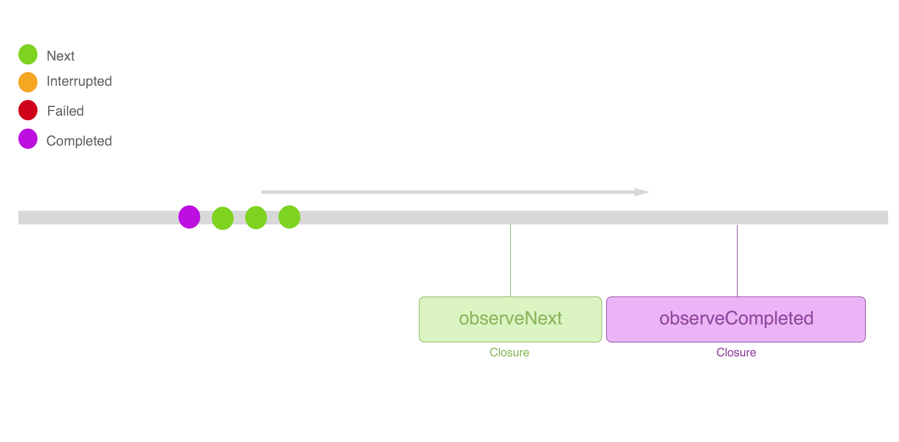

# Operators

With the concepts explained before you can start working with your first signals and signal producers. However, the most interesting part of Reactive is how we can combine them thanks to operators. Operators in ReactiveCocoa are primitives provided by the framework that can be applied over the streams of events. An *operator* then, is a function that transform signals and signals producers.

## Performing side effects

### Observation

Signals can be **observe**. It means that we can know about the events that are sent through that signal and specify what to do in that case.
ReactiveCocoa provides different operators for observation depending on the event you want to observe:

~~~~~~~~
mySignal.observe { event in
  // Observe all kind of events
  switch event {
    default: break
  }
}
mySignal.observeFailed { error in 
  print("Oh, something went wrong: \(error)")
}
mySignal.observeCompleted
mySignal.observeInterrupted
mySignal.observeNext { data in 
  print("Yeah!, new data: \(data)")
}
~~~~~~~~

T> Note that the side effects are specified with closures. Be careful retaining variables from the external scope of variables. The closure will be retained during the signal execution and a bad implementation of the signal might lead to components retained in memory and never released.

X> Signals shouldn't propagate more next events once the stream has been completed, cancelled or interrupted. In order to validate that I propose you the following exercise:
X> 1. Create a `Signal<Int, NoError>` using the pipe initializer.
X> 2. Observe that signal events printing next and completed events.
X> 3. Send the folloging events: 0, 1, 2, .Completed, 3. What do can you see in your console?

### Injecting effects

Similar to observe, with signal producers we can observe the events sent. In this case we use the `on` operator that returns another producer. It allows us chaining multiple observers applied to the same source producer.

~~~~~~~~
let otherProducer = sourceProducer
    |> on(started: {
        println("Started")
    }, event: { event in
        println("Event: \(event)")
    }, failed: { error in
        println("Error: \(error)")
    }, completed: {
        println("Completed")
    }, interrupted: {
        println("Interrupted")
    }, terminated: {
        println("Terminated")
    }, disposed: {
        println("Disposed")
    }, next: { next in
        println("Next: \(next)")
    })
~~~~~~~~

I> The method `on` has the parameters as optionasl, thus if you want to provide only the callback for the completed event you can pass only that callback.

## Composition

### Lift

`lift` operators allow applying signal operators to a `SignalProducer`. The operator creates a new `SignalProducer` like if the operator had been applied to each produced `Signal` individually.

## Transforming

### Mapping
`map` operator transforms the event next values using using the passed function. Given an input `Signal<T, NoError>`/`SignalProducer<T, NoError>` and a function that transform `T` into a new type `M`, `myFunc(input: T) -> M` the operator can be applied on this way:

~~~~~~~~
mySignal.map(mappingFunction)
~~~~~~~~

Imagine we have a text field where the user inputs data and we have to validate that the introduced data is not empty. Our current signal only returns the text that the user is typing in the field. Thanks to the `map` operator we can have instead a signal that returns `true` or `false` depending on wether the field is empty or not:

~~~~~~~~
let (userTextSignal, userTextObserver) = Signal<Int, NoError>.pipe()
let isValid: Signal<Bool, NoError> = userTextSignal.map{$0 != ""}
isValid.observeNext { valid in print(valid) }
userTextObserver.sendNext("") // should print false
userTextObserver.sendNext("pep@") // should print true
~~~~~~~~
> Note: $0 represents the values sent through the signal where in this case it's the text introduced.
 

X> Suppose we have a `Signal<AnyObject, NoError>` where `AnyObject` represents an API JSON response, try to map these responses into a custom plain model, for example `User` or `Track`. 

### Filtering
`filter` is used to filter next values using a provided predicate. Only these values that satisfy the predicate will be propagated to the output stream. The `filter` operator expects a closure where that takes each next value and returns `true`/`false`:

~~~~~~~~
mySignal.filter(filterFunction)
~~~~~~~~

### Aggregating
// TODO

## Combining

### Latest values
// TODO

### Zipping
// TODO

## Flattening

### Concatenating
// TODO

### Merging
// TODO

### Switching to the latest
// TODO

## Handling Errors

### Catching Errors
//TODO

### Mapping Errors
//TODO

### Retrying
//TODO

### Promote errors

### DON'T FORGET
- Mention how the source signals are disposed when the combined signal is disposed
- Mention Red library that add extra operators and mention these operators.
- Mention this util website: http://rxmarbles.com/
